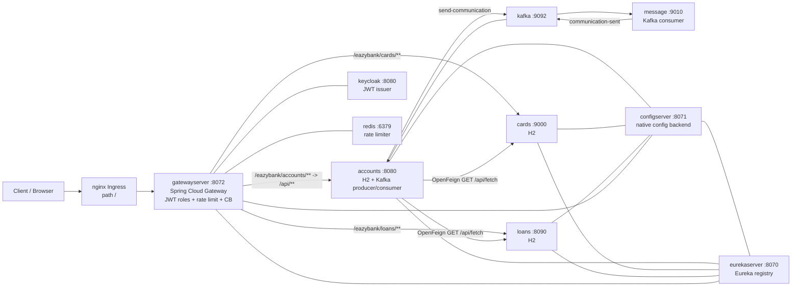

# EazyBank

EazyBank is a demo retail-banking system built as a set of **Spring Boot 4 / Spring Cloud microservices** (Java 21), packaged for **Docker Compose** and **Kubernetes**. It follows the well-known EazyBytes microservices course architecture: a central config server, Eureka service discovery, an OAuth2/JWT-secured API gateway (Keycloak), per-service in-memory H2 databases, Kafka-based event-driven communication, Resilience4j resilience patterns, and Micrometer/Actuator observability.

> **This is a learning/portfolio project, not production software.** Single replicas, in-memory databases, and demo credentials (see [Security notes](#security-notes)).

## Architecture



### Services

| Service | Port | Role |
|---|---|---|
| `configserver` | 8071 | Spring Cloud Config Server (`native` profile, YAML from `classpath:/config`) |
| `eurekaserver` | 8070 | Eureka service registry (does not register itself) |
| `gatewayserver` | 8072 | API gateway: Keycloak JWT roles, correlation-ID filters, Redis rate limiter (cards), circuit breaker (accounts), retry (loans) |
| `accounts` | 8080 | Core service: customer + accounts CRUD, Feign aggregation of cards/loans, Kafka event publishing/consuming |
| `cards` | 9000 | Cards CRUD (Docker Compose maps host `8081` → container `9000`) |
| `loans` | 8090 | Loans CRUD |
| `message` | 9010 | Kafka consumer service (`email|sms` function chain) simulating notifications |

Supporting infrastructure: **Kafka** 4.0.0 (KRaft, single node, ports 9092/9093), **Redis** 7 (6379), **Keycloak** 26.2.1 (8080 HTTP, 9000 health; Kubernetes only).

All services register with Eureka and pull their central config from the config server (`optional:` import, so boot order still matters — see the Kubernetes notes).

## Prerequisites

- **JDK 21** (`JAVA_HOME`, or a `jdk-21*` folder under `%USERPROFILE%\jdks` — the PowerShell scripts auto-detect it)
- **PowerShell** (for `build.ps1` / `run-local.ps1` / `stop-local.ps1` / `recreate.ps1`)
- For containers: **Docker** with the Compose plugin
- For Kubernetes: **kubectl**, an **nginx ingress controller**, and a way to build/load the images into your cluster's nodes
- Maven itself is **not** required — every module bundles the Maven wrapper (`mvnw.cmd` on Windows, `mvnw` on Unix)

## Local run (JARs)

```powershell
# 1. Build the shared BOM (installs the `common` library) and all services, skipping tests
powershell -ExecutionPolicy Bypass -File .\build.ps1

# 2. Start all seven services sequentially (config -> eureka -> gateway -> apps),
#    waiting for each port; logs are written to .\logs\
powershell -ExecutionPolicy Bypass -File .\run-local.ps1

# 3. Stop everything again
powershell -ExecutionPolicy Bypass -File .\stop-local.ps1
```

Sanity checks:

- Eureka dashboard: <http://localhost:8070/>
- Config server: <http://localhost:8071/accounts/prod>
- Through the gateway: <http://localhost:8072/eazybank/accounts/build-info>

> Local JAR runs do **not** start Kafka, Redis, or Keycloak. The Kafka binder falls back to `kafka:9092`, which only resolves if you run the infra separately (e.g. via Docker Compose) or add a hosts entry. Sync HTTP endpoints (accounts/cards/loans CRUD via the gateway) work fine without them.

## Docker Compose

```bash
docker compose -f compose.yml up --build
```

Builds each service image from its `Dockerfile` and starts the full stack on the bridge network `eazybank`, in health-gated order (configserver healthy → eurekaserver → apps), plus Redis and single-node Kafka. Host ports: `8071` (config), `8070` (eureka), `8072` (gateway), `8080` (accounts), `8081→9000` (cards), `8090` (loans), `9010` (message), `6379` (redis), `9092` (kafka).

Tear down with `docker compose -f compose.yml down`.

> Keycloak is **not** part of the Compose stack; the gateway's JWT validation needs it only when you call role-protected endpoints with tokens. GET endpoints are permitted without a token by design of this demo (see Security notes).

## Kubernetes

Plain manifests (no Helm/operators), all in namespace `eazybank`:

```powershell
# Nuke + recreate everything, wait for infra, restart apps, smoke-test via ingress
powershell -ExecutionPolicy Bypass -File .\recreate.ps1

# ...or manually:
kubectl apply -f k8s/namespace.yaml
kubectl apply -R -f k8s/
```

`recreate.ps1` encodes a deliberate two-phase bootstrap: the apps import central config with `optional:configserver:...`, so they are (re)started **after** configserver and eurekaserver are actually reachable — otherwise they would silently boot without central config.

Smoke test through the nginx ingress: <http://localhost/eazybank/accounts/contact-info> (or directly via the gateway `LoadBalancer`: <http://localhost:8072/eazybank/accounts/contact-info>).

**Images:** the manifests reference `eazybank/<service>:1.0` (gatewayserver `:1.1`) with `imagePullPolicy: IfNotPresent`. You must build and load them onto your cluster nodes yourself (e.g. `docker build`, `docker save | ctr images import`, minikube `minikube image load`, kind `kind load docker-image`, or push to a registry and adjust the manifests). See [Known limitations](#known-limitations) for why the tags differ across the repo.

## Configuration highlights

Configuration is centralized in `configserver/src/main/resources/config/` (profiles `{accounts,cards,loans}.{yml,-qa.yml,-prod.yml}`, `eurekaserver.yml`, `gatewayserver.yml`). Services set `spring.profiles.active: prod` to pick up the `*-prod.yml` variants (`build.version` and contact-info blocks used by the `/contact-info` endpoints).

Key environment variables (all have working defaults for local dev):

| Variable | Default | Set to (Compose/K8s) | Purpose |
|---|---|---|---|
| `CONFIG_SERVER_HOST` | `localhost` | `configserver` | Host of the config server for `optional:configserver:...` import |
| `EUREKA_SERVER_HOST` | `localhost` | `eurekaserver` | Eureka `defaultZone` host |
| `KAFKA_BOOTSTRAP_SERVERS` | `kafka:9092` | `kafka:9092` | Kafka binder brokers for the accounts (producer/consumer) and message (consumer) services |
| `KEYCLOAK_HOST` / `KEYCLOAK_PORT` | `localhost` / `7080` | `keycloak` / `8080` | JWK-set URI used by the gateway's JWT validator |
| `DB_USERNAME` / `DB_PASSWORD` | `sa` / `changeme` | — | Credentials for the in-memory H2 database of accounts/cards/loans |
| `CONFIG_ENCRYPT_KEY` | `changeme` | Secret `configserver-encrypt` | Symmetric key the config server uses to encrypt/decrypt config values |
| `MANAGEMENT_ENDPOINTS_EXPOSE` | `health,info` | e.g. `health,info,prometheus` | Which actuator endpoints are exposed over HTTP |

Actuator is deliberately locked down: only `health` (with liveness/readiness probes) and `info` are exposed by default, and the shutdown/gateway actuator endpoints are no longer exposed. Everything is overridable via `MANAGEMENT_ENDPOINTS_EXPOSE` if you want metrics or the gateway actuator endpoint back.

Gateway routes are defined in **one place only** — the programmatic `RouteLocator` in `GatewayserverApplication` (path rewrite, circuit breaker on accounts, retry on loans, Redis rate limiter on cards). The config server's `gatewayserver.yml` intentionally contains no `spring.cloud.gateway.routes`.

## Security notes

- **Secrets are externalized.** No credentials are hardcoded in YAML: the H2 datasource credentials (`DB_USERNAME`/`DB_PASSWORD`), the config-server encryption key (`CONFIG_ENCRYPT_KEY`), and the Keycloak admin credentials all come from environment variables with safe demo defaults (`changeme`).
- **Kubernetes uses Secret refs.** `k8s/keycloak/secret.yaml` and `k8s/configserver/secret.yaml` contain demo values and are consumed via `secretKeyRef`. **Change them before deploying anywhere real**, or replace them with Sealed Secrets / your secret manager.
- **Actuator is restricted** to `health`/`info` by default (previously every endpoint, including an unrestricted shutdown endpoint, was exposed).
- Still demo-grade on purpose: the H2 console is enabled, the database is in-memory, all Keycloak tokens come from the `master` realm, and the gateway permits **all GET requests** without a token (role matchers apply to the service paths on top). Treat the whole stack as a lab.

## Known limitations

- **Image tags are inconsistent — documented as-is, not unified.** Compose builds/uses `eazybank/<service>:1.0`, the Kubernetes manifests use `:1.0` except `gatewayserver:1.1`, and the Jib Maven plugin is configured with the tag `s20`. Unifying them would break already-running deployments that reference the current tags; build with the tag your deployment expects.
- No persistence anywhere: every service uses an in-memory H2 database, so all data is lost on restart. No PVCs/StatefulSets.
- Single replica per service; no PodDisruptionBudgets, HPA, or resource requests/limits on the Java deployments (only Keycloak has them).
- `run-local.ps1` does not start Kafka/Redis/Keycloak (see Local run).
- Feign fallbacks return `null`, so a cards/loans outage silently omits that slice from `fetchCustomerDetails`.
- The gateway allows unauthenticated GET requests; Keycloak only guards against role checks on the service paths, and this demo does not manage a dedicated realm (it uses `master`).

## License

[MIT](LICENSE) — Copyright (c) 2026 mohamed bakrim. Originally derived from the EazyBytes microservices course (Apache-2.0).
